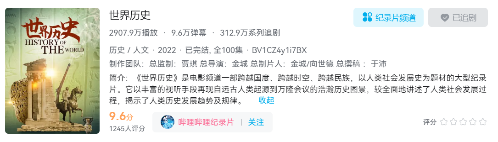

# 世界历史文字记录

[记录片地址](https://www.bilibili.com/bangumi/play/ss41863)

> 内容包含自远古人类起源到万隆会议的浩瀚历史图景，较全面地讲述了人类社会发展过程，揭示了人类历史发展趋势及规律。

## 目录

1. [人类历史的开端-石器时代](./世界历史/1.人类历史的开端-石器时代.md)
2. [文明的起源](./世界历史/2.文明的起源.md)
3. [古代文字的起源](./世界历史/3.古代文字的起源.md)
4. [古代两河流域文明(1)](./世界历史/4.古代两河流域文明(1).md)
5. [古代两河流域文明(2)](./世界历史/5.古代两河流域文明(2).md)
6. [古代埃及文明(1)](./世界历史/6.古代埃及文明(1).md)
7. [古代埃及文明(2)](./世界历史/7.古代埃及文明(2).md)
8. [印度河文明之谜](./世界历史/8.印度河文明之谜.md)
9. [克里特-迈锡尼文明](./世界历史/9.克里特-迈锡尼文明.md)
10. [古代希腊文明的回声](./世界历史/10.古代希腊文明的回声.md)
11. [古代希腊文化](./世界历史/11.古代希腊文化.md)
12. [希腊化时代](./世界历史/12.希腊化时代.md)
13. [罗马共和国](./世界历史/13.罗马共和国.md)
14. [罗马帝国](./世界历史/14.罗马帝国.md)
15. [古代罗马文化](./世界历史/15.古代罗马文化.md)
16. [亚欧民族大迁徙与中世纪的开端](./世界历史/16.亚欧民族大迁徙与中世纪的开端.md)
17. [西欧封建国家](./世界历史/17.西欧封建国家.md)
18. [拜占庭帝国](./世界历史/18.拜占庭帝国.md)
19. [基辅罗斯和俄罗斯统一国家的建立](./世界历史/19.基辅罗斯和俄罗斯统一国家的建立.md)
20. [历史上的阿拉伯帝国](./世界历史/20.历史上的阿拉伯帝国.md)
21. [中世纪西欧的社会生活](./世界历史/21.中世纪西欧的社会生活.md)
22. [十字军东侵](./世界历史/22.十字军东侵.md)
23. [文艺复兴（1）](./世界历史/23.文艺复兴（1）.md)
